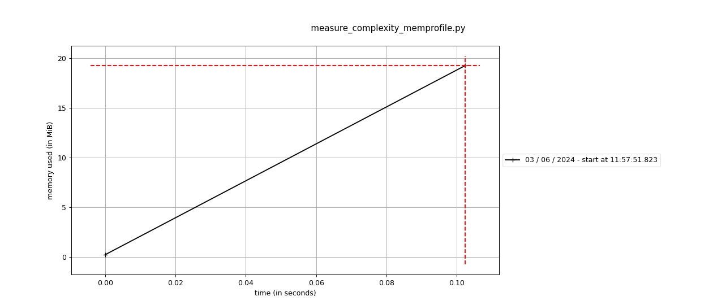

# AVL Tree Performance Profiling

This project contains code for measuring the time complexity of an AVL tree implementation. The profiling is done using `cProfile` to identify the functions that consume the most time during execution, and `memory_profiler` to measure memory usage.

## Profiling Results

### cProfile Results

The profiling results indicate that the top five functions, in terms of total calls, are:

1. **_height**: 118638/6116 calls
2. **max**: 56261 calls
3. **_balance**: 1501 calls
4. **_insert**: 1266/200 calls
5. **_delete**: 535/100 calls

### Memory Profiling Results

The memory profiling plot generated by `mprof` indicates the following:

- The memory usage increases linearly over time during the execution of the `measure_complexity` function.
- The peak memory usage reaches approximately 20 MiB.
- The memory usage stabilizes at the peak, indicating that the memory allocation for the dataset and operations is consistent once the initial dataset is loaded and processed.

### Conclusion

The profiling results from `cProfile` highlight that the `_height` and `max` functions are the most frequently called and therefore are critical areas for potential optimization. The `_balance`, `_insert`, and `_delete` functions, while called less frequently, are also significant in terms of execution time and could benefit from further optimization.

The memory profiling results indicate a steady increase in memory usage, peaking at around 20 MiB. This suggests that the memory footprint of the AVL tree operations is manageable but can still be monitored for potential improvements. Focusing on optimizing both the time complexity of frequently called functions and the memory usage could lead to more efficient and performant code.

